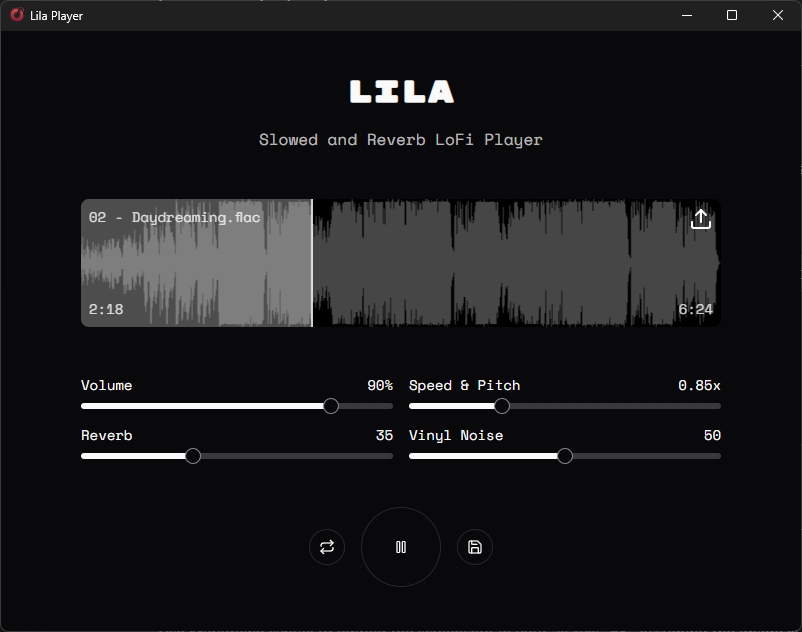

# Lila Player

### 🎧 Open Source Slowed + Reverb Desktop App for Windows, macOS & Linux

<p align="center">
  
</p>

<p align="center">
  <a href="https://github.com/ph33nx/lila-player/releases"></a>
  <a href="https://github.com/ph33nx/lila-player/blob/main/LICENSE"></a>
</p>

---

**Lila** is a free, open source desktop audio player that transforms any song into aesthetic **slowed and reverb** lofi tracks. Built with **Rust** (Tauri 2) and **React/Next.js**, it delivers native performance across **Windows**, **macOS**, and **Linux** — no Electron bloat, no subscriptions, no ads. Perfect for your **self-hosted** music workflow or **homelab** setup.

> *Create dreamy slowed + reverb edits, nightcore, or vaporwave-style audio — all offline, all private, all yours.*

### ✨ Why Lila?

| Feature | Description |
|---------|-------------|
| 🎚️ **Speed & Pitch Control** | Slow down or speed up audio from 0.65x to 1.35x |
| 🌊 **Lush Reverb** | Add customizable reverb depth for that signature lofi sound |
| 📀 **Vinyl Crackle** | Authentic vinyl noise overlay for vintage warmth |
| 📊 **Waveform Visualizer** | Real-time audio visualization with seek support |
| 💾 **Export to WAV** | Save your slowed + reverb creations as high-quality audio |
| 🔁 **Loop Playback** | Seamless looping for continuous listening |
| 🪶 **Lightweight** | ~10MB app size, minimal resource usage (Rust-powered) |
| 🔒 **Privacy-First** | 100% offline — your music never leaves your device |

---

## 🚀 Quick Start

### Download Pre-built Binaries

Head to [**Releases**](https://github.com/ph33nx/lila-player/releases) and download for your platform:
- **Windows**: `.msi` or `.exe` installer
- **macOS**: `.dmg` (Intel & Apple Silicon)
- **Linux**: `.AppImage` or `.deb`

---

## ❓ Installation FAQ

> **Why isn't the app signed?**  
> Lila is a free, open source project. Code signing certificates cost $99–$400/year from Apple and Microsoft. We'd rather spend that on coffee. ☕ You can always [build from source](#-development) if you prefer.

<details>
<summary><b>macOS: "Lila Player is damaged and can't be opened"</b></summary>

macOS quarantines unsigned apps downloaded from the internet. To fix:

```bash
xattr -d com.apple.quarantine /Applications/Lila\ Player.app
```

Then open Lila Player again.
</details>

<details>
<summary><b>Windows: "Windows protected your PC" (SmartScreen)</b></summary>

Windows SmartScreen blocks unsigned apps. To run anyway:

1. Click **"More info"**
2. Click **"Run anyway"**

If "Run anyway" doesn't appear: Right-click the installer → Properties → check **"Unblock"** → Apply.
</details>

<details>
<summary><b>Linux: AppImage won't run</b></summary>

Make it executable first:

```bash
chmod +x Lila.Player-*.AppImage
./Lila.Player-*.AppImage
```
</details>

---

## 📦 Versioning

Update version in both `package.json` and `src-tauri/tauri.conf.json`. Pushing to `master` triggers GitHub Actions to build and release binaries automatically.

---

## 🛠️ Development

### Prerequisites — All Platforms

1. **Node.js (v20+ LTS recommended, v24 LTS latest)**
   ```bash
   # Verify installation
   node --version
   npm --version
   ```
   Download from [nodejs.org](https://nodejs.org) if not installed.

2. **Rust**

   **macOS / Linux:**
   ```bash
   curl --proto '=https' --tlsv1.2 -sSf https://sh.rustup.rs | sh
   ```

   **Windows (PowerShell):**
   ```powershell
   winget install --id Rustlang.Rustup
   rustup default stable-msvc
   ```

   Verify installation:
   ```bash
   rustc --version
   cargo --version
   ```

### Linux Only (Debian/Ubuntu)

Install system dependencies:
```bash
sudo apt update
sudo apt install -y libwebkit2gtk-4.1-dev build-essential curl wget file \
  libxdo-dev libssl-dev libayatana-appindicator3-dev librsvg2-dev
```

### Linux Only (Fedora)

```bash
sudo dnf install webkit2gtk4.1-devel openssl-devel curl wget file libappindicator-gtk3-devel librsvg2-devel
```

### Linux Only (Arch/Manjaro)

```bash
sudo pacman -S webkit2gtk-4.1 base-devel curl wget file openssl appmenu-gtk-module libappindicator-gtk3 librsvg
```

## Development

1. **Clone the repository:**
   ```bash
   git clone https://github.com/ph33nx/lila-player
   cd lila-player
   ```

2. **Install dependencies:**
   ```bash
   npm install
   ```

3. **Start development server:**
   ```bash
   npm run tauri dev
   ```

4. **Build for production:**
   ```bash
   npm run tauri build
   ```

## Scripts

| Command | Description |
|---------|-------------|
| `npm run tauri dev` | Start Tauri app in dev mode |
| `npm run tauri build` | Build production desktop app |
| `npm run lint` | Run ESLint |
| `npm run format` | Format code with Prettier |
| `npm run typecheck` | Run TypeScript type checking |
| `npm run deps:check` | Check for dependency updates |
| `npm run deps:upgrade` | Upgrade to latest minor versions |
| `npm run deps:latest` | Upgrade to latest versions (including major) |

## Tech Stack

- **Frontend:** Next.js 15, React 19, TailwindCSS
- **Desktop:** Tauri 2 (Rust)
- **Audio:** Web Audio API
- **UI Components:** Radix UI, Framer Motion

## License

MIT
