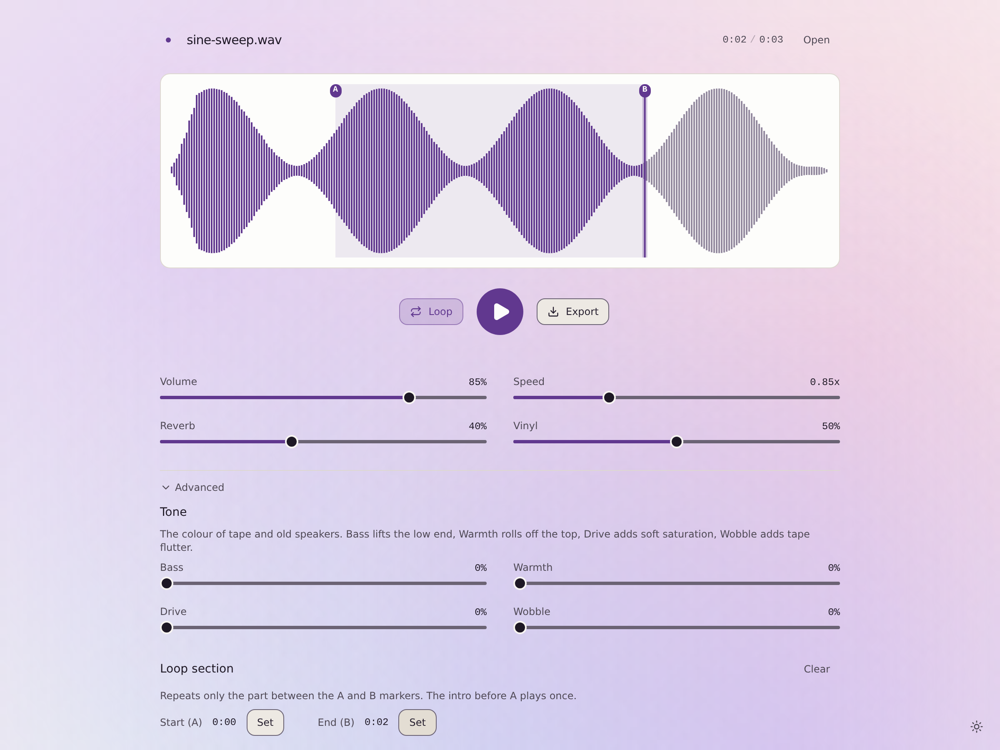

# Lila Player

### Free and open source slowed and reverb lofi player for Windows, macOS and Linux

Lila Player is a free, open-source desktop app for Windows, macOS and Linux that turns any audio file into a slowed and reverb lofi version, offline, with a WAV export.

[](https://github.com/ph33nx/lila-player/releases/latest)
[](https://github.com/ph33nx/lila-player/releases)
[](https://github.com/ph33nx/lila-player/blob/main/LICENSE)
[](https://github.com/ph33nx/lila-player/actions/workflows/ci.yml)
[](https://github.com/ph33nx/lila-player/actions/workflows/publish.yml)
[](https://github.com/ph33nx/lila-player/actions/workflows/deploy-pages.yml)




## Download

- [**Download the latest release**](https://github.com/ph33nx/lila-player/releases/latest) for Windows, macOS or Linux
- [**Open the web app**](https://ph33nx.github.io/lila-player/) if you would rather not install anything

| Platform            | Files                       | Size              |
| ------------------- | --------------------------- | ----------------- |
| Windows x86_64      | `.exe` installer, `.msi`    | 5 MB, 6 MB        |
| macOS Apple Silicon | `.dmg`                      | 7 MB              |
| macOS Intel         | `.dmg`                      | 7 MB              |
| Linux x86_64        | `.deb`, `.rpm`, `.AppImage` | 6 MB, 6 MB, 81 MB |

The AppImage is larger than the other Linux packages because it bundles its own runtime. Binaries are unsigned, so see [Installation help](#installation-help) for the first-run steps on macOS and Windows.

## What it does

| Control         | What it does                                                                                                                                                 | Range                                                |
| --------------- | ------------------------------------------------------------------------------------------------------------------------------------------------------------ | ---------------------------------------------------- |
| Speed and pitch | Slows down or speeds up the track. Pitch follows speed, so a slower track also sounds lower.                                                                 | 0.65x to 1.35x, in steps of 0.05                     |
| Reverb          | Crossfades between the dry track and a convolution reverb. 0 is fully dry, 100 is fully wet.                                                                 | 0 to 100                                             |
| Vinyl crackle   | Layers generated vinyl surface noise underneath, hiss and pops.                                                                                              | 0 to 100                                             |
| Volume          | Output level, with headroom above 100 % for quiet tracks.                                                                                                    | 0 to 110 %                                           |
| Tone            | Bass lifts the low end, Warmth rolls off the top, Drive adds soft saturation, Wobble adds tape flutter.                                                      | 0 to 100 % each, under Advanced                      |
| Loop            | Repeats the whole track.                                                                                                                                     | On or off                                            |
| Loop section    | Repeats only the part between the A and B markers. The intro before A plays once.                                                                            | Advanced, Loop section: Start, End, Clear            |
| Waveform        | Draws the track and seeks to wherever you click.                                                                                                             | Click to seek                                        |
| WAV export      | Renders your current speed, reverb, tone and volume settings to a WAV file.                                                                                  | Vinyl crackle is not included in the export          |
| Theme           | Light or dark. Follows your device until you switch, then remembered between launches.                                                                       | Button at the bottom right                           |
| Media keys      | Play and pause from your keyboard or system media controls.                                                                                                  | Play, pause                                          |
| Open a file     | The Open audio button, a drag and drop anywhere on the window, or Ctrl+O (Cmd+O on macOS).                                                                   | MP3, WAV, FLAC, OGG, M4A, AAC, AIFF, OPUS, WEBM, WMA |
| Keyboard        | Space plays and pauses, arrows seek 5 seconds, L toggles loop, [ and ] set the loop start and end. Scroll over a slider to nudge it a step, five with Shift. | Ctrl+E (Cmd+E) exports                               |

## How to make a slowed and reverb song with Lila

1. Open Lila Player and click **Open audio**, or drop an audio file anywhere on the window. The waveform appears once the file is decoded.
2. Drag **Speed** below `1.00x` to slow the track down. It opens at `0.85x`, which is a common starting point for slowed and reverb.
3. Raise **Reverb** to add space. The slider crossfades between the dry track and the reverb, so `0` leaves the track dry and `100` is fully wet.
4. Raise **Vinyl** if you want vinyl crackle under the track.
5. Set **Volume**. It goes up to `110%` if the source is quiet.
6. Press play. Click anywhere on the waveform to seek, and use the loop button to repeat the whole track.
7. To repeat one section instead of the whole track, open **Advanced**. Under **Loop section**, move the playhead to where the section starts and press **Set** on the Start row, then move it to the end and press **Set** on the End row. Lila plays the intro once, then loops A to B. **Clear** goes back to looping the whole track.
8. Press **Export** to render a WAV with your current speed, reverb, tone and volume settings. The file is saved as `<your file>-lofi.wav`, without the original extension.

## Your audio never leaves your device

Lila Player does all of its work on your own machine. Your file is read from disk, decoded into memory, processed there, and the WAV export is rendered locally. Nothing is uploaded, there is no account, and the desktop app needs no network connection to play or export audio.

The web app at [ph33nx.github.io/lila-player](https://ph33nx.github.io/lila-player/) works the same way. The page loads once, then every file you open is decoded and processed in your browser. Your audio is never sent to a server.

## FAQ

### Is Lila Player free?

Yes. Lila Player is free to download and free to use. There is no account, no subscription, no trial and no ads. The source code is MIT licensed, so you can read it, change it and redistribute it.

### Does it work offline?

Yes. All audio processing happens on your device. Once the desktop app is installed it never needs a network connection to open a file, slow it down, add reverb or export a WAV.

### What formats can I open?

Any audio file your system can decode. That normally covers MP3, WAV, M4A and AAC everywhere, plus formats like FLAC and OGG depending on your operating system. Decoding is handled by the audio decoder built into the system webview, so the exact list varies by platform.

### Can I export?

Yes. The Export button renders your current speed, reverb, tone and volume settings to an uncompressed WAV file. The render runs offline in a single pass rather than in real time, so it finishes faster than the length of the track. Vinyl crackle is a playback layer and is not included in the export.

### Does the pitch change when I slow a track?

Yes. Speed and pitch move together, so slowing a track also lowers its pitch. That is the sound most slowed and reverb edits use. Lila Player does not currently offer pitch-preserving time stretching.

### Why is the app not signed?

Code signing certificates from Apple and Microsoft are a recurring yearly cost, and Lila Player is an unpaid open source project, so the released binaries are unsigned. macOS and Windows will warn you the first time you open the app. The Installation help section lists the exact steps for each platform, and you can always build from source instead.

### Is there a web version?

Yes. The same player runs in your browser at https://ph33nx.github.io/lila-player/, with the same controls and the same WAV export. It processes audio in the browser and does not upload your files.

### How is this different from online slowed reverb tools?

Lila Player runs on your own machine instead of on someone else's server. There is nothing to upload and nothing to wait in a queue for, no account to create, no watermark, and no cap on file size or track length beyond your own memory. The export is an uncompressed WAV rather than a re-encoded download. Because the source is MIT licensed you can read exactly what the app does to your audio.

## Installation help

<details>
<summary><b>macOS: "Lila Player is damaged and can't be opened"</b></summary>

macOS quarantines unsigned apps downloaded from the internet. To fix:

```bash
xattr -d com.apple.quarantine /Applications/Lila\ Player.app
```

Then open Lila Player again.
</details>

<details>
<summary><b>Windows: "Windows protected your PC" (SmartScreen)</b></summary>

Windows SmartScreen blocks unsigned apps. To run anyway:

1. Click **"More info"**
2. Click **"Run anyway"**

If "Run anyway" doesn't appear: Right-click the installer → Properties → check **"Unblock"** → Apply.
</details>

<details>
<summary><b>Linux: AppImage won't run</b></summary>

Make it executable first:

```bash
chmod +x Lila.Player-*.AppImage
./Lila.Player-*.AppImage
```

</details>

## Development

Contributor docs: [docs/index.md](docs/index.md)

### Prerequisites, all platforms

1. **Node.js (v20+ LTS recommended, v24 LTS latest)**

   ```bash
   node --version
   npm --version
   ```

   Download from [nodejs.org](https://nodejs.org) if not installed.

2. **Rust**

   macOS and Linux:

   ```bash
   curl --proto '=https' --tlsv1.2 -sSf https://sh.rustup.rs | sh
   ```

   Windows (PowerShell):

   ```powershell
   winget install --id Rustlang.Rustup
   rustup default stable-msvc
   ```

   Verify:

   ```bash
   rustc --version
   cargo --version
   ```

### Linux system dependencies

Debian and Ubuntu:

```bash
sudo apt update
sudo apt install -y libwebkit2gtk-4.1-dev build-essential curl wget file \
  libxdo-dev libssl-dev libayatana-appindicator3-dev librsvg2-dev
```

Fedora:

```bash
sudo dnf install gcc make pkg-config openssl-devel webkit2gtk4.1-devel gtk3-devel librsvg2-devel
```

Arch and Manjaro:

```bash
sudo pacman -S webkit2gtk-4.1 base-devel curl wget file openssl appmenu-gtk-module libappindicator-gtk3 librsvg
```

### Run it

```bash
git clone https://github.com/ph33nx/lila-player
cd lila-player
npm install
npm run tauri dev
```

Build the desktop app with `npm run tauri build`.

## Scripts

| Command                | Description                                                                   |
| ---------------------- | ----------------------------------------------------------------------------- |
| `npm run dev`          | Start the Next.js dev server on port 3123                                     |
| `npm run tauri dev`    | Start the Tauri app in dev mode                                               |
| `npm run tauri build`  | Build the production desktop app                                              |
| `npm run build`        | Build the static web export into `out/`                                       |
| `npm run lint`         | Run ESLint                                                                    |
| `npm run format`       | Format code with Prettier                                                     |
| `npm run typecheck`    | Run TypeScript type checking                                                  |
| `npm run test:unit`    | Run the Vitest unit suite                                                     |
| `npm run test:e2e`     | Run the Playwright e2e suite (build first)                                    |
| `npm run verify`       | Typecheck, lint, unit tests and build                                         |
| `npm run screenshots`  | Capture the UI state matrix, or `-- --readme` to regenerate the README images |
| `npm run deps:check`   | Check for dependency updates                                                  |
| `npm run deps:upgrade` | Upgrade to latest minor versions                                              |
| `npm run deps:latest`  | Upgrade to latest versions, including major                                   |

## Tech stack

- **Frontend:** Next.js 15, React 19, Tailwind CSS
- **Desktop shell:** Tauri 2, Rust
- **Audio:** Web Audio API, with `OfflineAudioContext` for the WAV export
- **UI:** Radix UI, Motion

## License

MIT. See [LICENSE](https://github.com/ph33nx/lila-player/blob/main/LICENSE).
